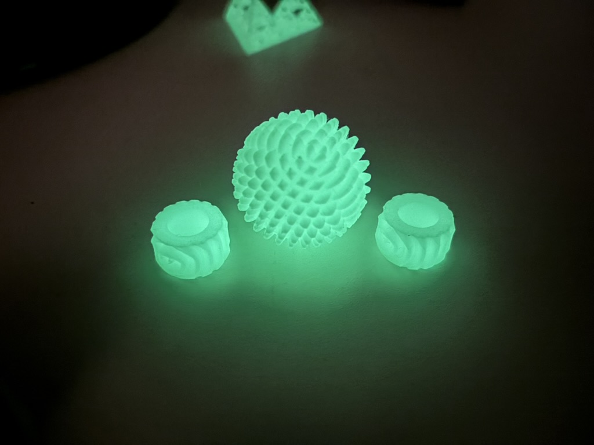

# 球状歯車を作成するOpenSCADライブラリ

- inv_gear(m,z,alpha)：インボリュート歯車を作成するモジュール
    - z：歯数
    - m モジュール
    - alpha：圧力角

- sph_gear(m,z,alpha)：基本球状歯車(Basic spherical gear)を作成するモジュール
- CS_gear(m,z,alpha)：直交球状歯車(Cross spherical gear)を作成するモジュール
- mpl_gear(m,z,alpha)：鞍状歯車(Monopole gear)を作成するモジュール